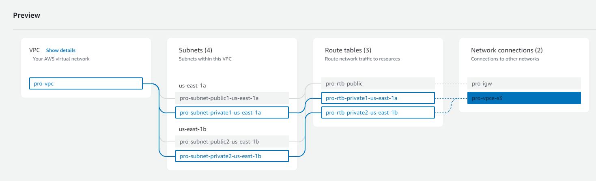

# VPC with Public-Private Subnet in Production

## About the Project

This example demonstrates how to create `a VPC` that we can use for servers in a production environment.

To `improve resiliency`, we deploy the servers in two `Availability Zones`, by using an `Auto Scaling Group` and a `Load Balancer`. For additional security, we deploy servers in private subnets. The servers receive requests from the Internet through the Load Balancer, which is in a public subnet. The Load Balancer distributes the requests to the servers in the private subnets. The servers in the private subnets can access the Internet through a NAT gateway that is in a public subnet.

To `improve resiliency`, we deploy NAT Gateway in both `Availability Zones`.

## Architecture Diagram

[Example](https://docs.aws.amazon.com/vpc/latest/userguide/vpc-example-private-subnets-nat.html)


## Overview

- The VPC has public subnets and private subnets in two Availability zones
- The public subnets each have a NAT Gateway and an Application Load Balancer node
- The servers launched in the private subnets, are launched and terminated using an AutoScaling groups, and receive traffic from the Load Balancer.
- The servers can connect to the internet by using the NAT Gateway. The NAT Gateway is used by the servers to download software updates and to send log files to a central logging service.
- The `NAT Gateway masks` the IP addresses of the servers in the private subnets from the internet.

## Prerequisites

- Auto Scaling Group
- Load Balancer
- Target Group
- Bastion Host or Jump Server: Jump Server can be created across `availability zones`. When we create a bastion host or any EC2 instance in public subnet, they get created with both public and private IP address where the private IP address is from the VPC range. Any instances with the public IP address within the VPC can communicate with the private addresses.

- [VPC NAT Gateways User Guide](https://docs.aws.amazon.com/vpc/latest/userguide/vpc-nat-gateway.html)



Route Table

- For public subnets (contains local routes as well as routes to the Internet Gateway)
- For private subnets (contains local routes as well as routes to the NAT Gateway,egress-obly Internet Gateway, and gateway VPC endpoints)

## Load Balancer

Create load balancer and attach private instances as `target group`.

Types

- Application Load Balancer (ALB): Layer 7 load balancer (HTTP and HTTPS traffic)
- Network Load Balancer (NLB)
- Gateway Load Balancer (GLB)

Load Balancer should always be `public facing` and it should be in `public subnet`.

- Just like we created 'Launch Template' for the Auto Scaling Group we should create a 'Target Group' for Load Balancer.

## Copy the local key pair to the remote server

- Use `SCP` (Secure Copy) command to securely transfer files.

e.g.

```bash
scp -i locationtokeypair.pem locationtokeypair.pem ubuntu@<public-ip-address>:/home/ubuntu
```

To run the Python HTTP server in the EC2 instance.

```bash
python3 -m http.server 8000
```
